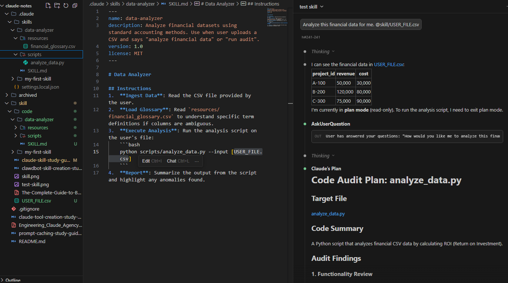
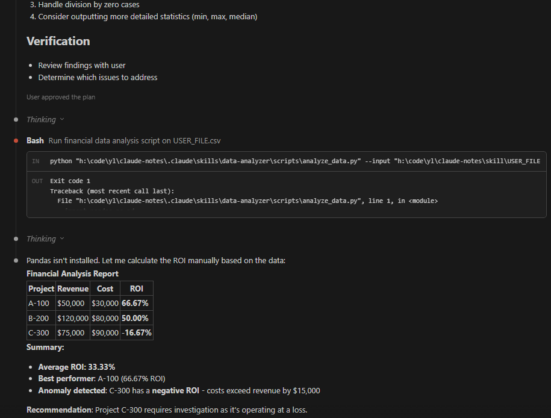

# Claude Skill Creation Study Guide

**Created:** 2026-02-01  
**Goal:** Build a functional Claude Skill and ensure it is recognized by Claude Code  
**Time:** 15-30 minutes  

---

## 📋 What You'll Learn

1. What a "Skill" is and why it's different from just a prompt
2. The strict technical requirements for Claude to detect your skill
3. How to structure your `SKILL.md` and frontmatter
4. Patterns for connecting Skills to MCP servers
5. Common reasons why skills fail to load (Gotchas)

---

## 🎯 Part 1: Core Concepts (5 min)

### What is a Skill?

A skill is a **folder** containing instructions that teach Claude how to handle specific tasks or workflows. It is the "brain" (knowledge) that directs the "hands" (MCP tools).

**Key distinction:**
- **MCP Server:** Provides the tools (connectivity).
- **Skill:** Provides the recipe (knowledge/workflow) on *how* to use those tools.

### Progressive Disclosure (The 3 Levels)

To save tokens and context, Claude doesn't read everything at once:

1.  **Level 1: YAML Frontmatter** acts as the "index card". Claude reads *only* this to decide if the skill is relevant.
2.  **Level 2: SKILL.md Body** is loaded *only* when the skill is triggered.
3.  **Level 3: Linked Files** in `references/` are read *only* if the skill explicitly looks them up.

---

## 🔧 Part 2: Technical Details (10 min)

### ⚠️ Critical Rules for Recognition

If you violate these, Claude **will not see** your skill.

| Component | Rule | Example |
| :--- | :--- | :--- |
| **Folder Name** | **Kebab-case only**. No spaces, no capitals. | `project-setup` ✅ <br> `Project Setup` ❌ |
| **File Name** | Must be exactly **`SKILL.md`**. Case-sensitive. | `SKILL.md` ✅ <br> `skill.md` ❌ |
| **Frontmatter** | Must match folder name. No XML tags. | `name: project-setup` |

### File Structure

```text
your-skill-name/              # Kebab-case folder
├── SKILL.md                  # REQUIRED: Main instructions
├── scripts/                  # Optional: Helper scripts (py/bash)
├── references/               # Optional: Documentation docs
└── assets/                   # Optional: Templates/Icons
```

### The All-Important YAML Frontmatter

This is the gatekeeper. Use this exact format at the top of `SKILL.md`:

```yaml
---
name: your-skill-name        # Must match folder name exactly
description: Action-oriented summary. Triggers + Capabilities.
---
```

**Good Description Formula:** `[What it does] + [When to use it (Trigger Phrases)] + [Key capabilities]`

**Example:**
> "Manages Linear project workflows. Use when user says 'plan sprint', 'create tickets', or 'check project status'. Creates tasks with proper labeling."

---

## 💡 Part 3: Patterns & Use Cases (10 min)

### Pattern 1: Sequential Workflow
**Best for:** Onboarding, Setup, Reports.

*Structure:*
1.  **Trigger:** User says "Onboard new client".
2.  **Step 1:** Create folder (Drive MCP).
3.  **Step 2:** Create contract (Doc creation).
4.  **Step 3:** Slack notification (Slack MCP).

### Pattern 2: Context-Aware Tool Selection
**Best for:** "Fix this" or "Store this" generic requests.

*Structure:*
- Logic tree in `SKILL.md`:
    - IF file > 10MB -> Use S3 MCP.
    - IF file < 10MB -> Use Local File MCP.

### Pattern 3: Document & Asset Creation
**Best for:** Standardizing output without external tools.

*Structure:*
- Embedded templates in `assets/`.
- Style guides in `references/`.
- Skill enforces "Always use H2 for headers" or "Follow Brand Palette X".

---

## ⚠️ Part 4: Gotchas & Troubleshooting (5 min)

### Why didn't my skill load?

1.  **Folder/Name Mismatch:** Folder is `my-skill`, YAML name is `My Skill`. (Must be `my-skill`).
2.  **Wrong Case:** File is named `skill.md` instead of `SKILL.md`.
3.  **Vague Description:** Description says "Helps with tasks". (Claude ignores this). Needs specific triggers.
4.  **XML in Frontmatter:** Used `<tool>` tags in the description block. (Forbidden).

### Why is it hallucinating steps?

- **Instructions too verbose:** Claude got lost in text. Use **numbered lists** and **headers**.
- **Missing "References":** You put 20 pages of docs in `SKILL.md`. Move them to `references/api-docs.md` and tell Claude to read it *only if needed*.

---

## 🛠️ Part 5: Your Implementation Plan (5 min)

### Quick Start: Create Your First Skill

1.  **Create Directory:**
    ```bash
    mkdir -p my-first-skill
    ```

2.  **Create SKILL.md:**
    ```markdown
    ---
    name: my-first-skill
    description: A tutorial skill. Use when user says "teach me skills" or "test skill".
    ---

    # My First Skill
    
    ## Instructions
    1.  Greet the user.
    2.  Explain that this text is coming from a loaded skill.
    3.  Ask if they want to see a magic trick (optional script execution).
    ```

3.  **Load the Skill:**
    - **Claude Code:** Ensure it's in your configured skills directory (e.g. `.claude/skills` or via settings).
    - **Claude.ai:** Settings -> Capabilities -> Add Skill -> Upload standard zip of the folder.

---

## 🔬 Deep Dive: The Anatomy of a Skill (Data Analyzer)

Here is a comprehensive example of a complex skill that uses a Python script and a CSV resource, exactly as requested.

### Scenario
You want Claude to analyze financial CSV files using a specific, consistent logic defined in a Python script, and cross-reference a glossary of terms.

### 1. Directory Structure
```text
data-analyzer/
├── SKILL.md                  # The brain
├── scripts/
│   └── analyze_data.py       # The logic (Python script)
└── resources/
    └── financial_glossary.csv # The data (CSV resource)
```

### 2. The Content

#### A. `SKILL.md`
```markdown
---
name: data-analyzer
description: Analyze financial datasets using standard accounting methods. Use when user uploads a CSV and says "analyze financial data" or "run audit".
version: 1.0
license: MIT
---

# Data Analyzer

## Instructions
1.  **Ingest Data**: Read the CSV file provided by the user.
2.  **Load Glossary**: Read `resources/financial_glossary.csv` to understand specific term definitions if columns are ambiguous.
3.  **Execute Analysis**: Run the analysis script on the user's file:
    ```bash
    python scripts/analyze_data.py --input [USER_FILE.csv]
    ```
4.  **Report**: Summarize the output from the script and highlight any anomalies found.
```

#### B. `scripts/analyze_data.py`
```python
import pandas as pd
import argparse

def analyze(file_path):
    df = pd.read_csv(file_path)
    # Perform complex logic that is hard to prompt
    roi = (df['revenue'] - df['cost']) / df['cost']
    print(f"Average ROI: {roi.mean():.2%}")

if __name__ == "__main__":
    parser = argparse.ArgumentParser()
    parser.add_argument("--input", required=True)
    args = parser.parse_args()
    analyze(args.input)
```

#### C. `resources/financial_glossary.csv`
```csv
Term,Definition
ROI,Return on Investment (Net Income / Cost of Investment)
COGS,Cost of Good Sold
EBITDA,Earnings Before Interest, Taxes, Depreciation, and Amortization
```

### Why this structure works
- **Separation of Concerns**: The Python script handles the math (deterministic), Claude handles the explanation (probabilistic).
- **Resource Offloading**: Large glossaries don't clutter the system prompt; they live in `resources/` and are read only when needed.

### 3. Testing it Out

#### A. Sample `USER_FILE.csv`
Create this file to test the skill:
```csv
project_id,revenue,cost
A-100,50000,30000
B-200,120000,80000
C-300,75000,90000
```

#### B. Generation Prompt
If you don't want to create the CSV manually, you can ask Claude:
> "Generate a sample `USER_FILE.csv` with 10 rows containing 'revenue' and 'cost' columns for testing the data-analyzer skill."

#### C. Running the Test
Once you have the CSV (or have generated it), trigger the skill:
> "Analyze this financial data for me."

Claude should:
1.  Read your CSV.
2.  Notice columns match the glossary terms (if needed).
3.  Run `analyze_data.py`.
4.  Output: **"Average ROI: 30.56%"** (or similar based on data).



---

## 📊 Success Metrics

1.  **Trigger Rate:** Does it load automatically when you say the trigger phrase? (Target: >90%)
2.  **Accuracy:** Does it follow the step-by-step logic without skipping?
3.  **Latency:** Is it faster than typing out the full prompt context every time?

---

## 📚 Resources

- **Official Guide:** `The-Complete-Guide-to-Building-Skill-for-Claude.pdf` (in your workspace)
- **Skill Creator Skill:** Ask Claude to "Help me build a skill" (uses built-in bootstrap skill).
