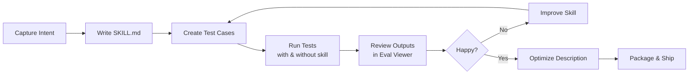

# Skill Creator — Practical Guide

A hands-on guide to building, testing, and optimizing Claude skills using the **skill-creator** skill. We'll walk through a real-world lab example: creating an **"excel-report"** skill that turns raw CSV/XLSX data into polished summary reports.

---

## What Is Skill Creator?

Skill Creator is a meta-skill — a skill that helps you build other skills. It provides a structured workflow for:

1. **Drafting** a new skill (or improving an existing one)
2. **Testing** it against realistic prompts (with and without the skill for comparison)
3. **Reviewing** outputs via an interactive browser viewer
4. **Iterating** based on human feedback + quantitative benchmarks
5. **Optimizing** the skill description so Claude triggers it at the right time
6. **Packaging** the finished skill into a `.skill` file for distribution

> [!TIP]
> You don't need to be a developer — skill-creator adapts its language to your comfort level. Just tell it what you want in plain English.

---

## The Core Loop at a Glance



---

## Real-World Lab: Building an "excel-report" Skill

### Scenario

You work in a team that frequently receives raw CSV or Excel files — sales data, survey results, server logs — and needs to turn them into clean summary reports with key findings and recommendations. You want Claude to do this consistently every time, following your team's report template.

---

### Phase 1 — Capture Intent

Start by telling Claude what you want:

```
I want to create a skill called "excel-report". When someone gives Claude
a CSV or XLSX file and asks for a summary or report, Claude should:
  1. Read the data
  2. Identify key columns, trends, and outliers
  3. Produce a markdown report following our template:
       # [Title]
       ## Executive Summary
       ## Key Findings  (with simple stats)
       ## Recommendations
```

Claude (via skill-creator) will then **interview you** to nail down the details:

| Question Claude asks | Your answer |
|---|---|
| What file formats? | `.csv` and `.xlsx` |
| Should it generate charts? | No, just text and tables |
| How should it handle missing data? | Flag it in Key Findings |
| Any max row count? | Works up to ~50 000 rows |
| Do you want test cases? | Yes |

> [!IMPORTANT]
> Don't rush past the interview. The more precise you are here, the fewer iterations you'll need later.

---

### Phase 2 — Write the SKILL.md

Based on your answers, Claude drafts the skill. Here's what the skeleton looks like:

```
excel-report/
├── SKILL.md            ← core instructions
└── references/
    └── report-template.md  ← the exact template to follow
```

**SKILL.md** (abbreviated):

```yaml
---
name: excel-report
description: >
  Generate a structured summary report from CSV or XLSX data files.
  Use whenever the user uploads a spreadsheet and asks for analysis,
  a summary, key findings, trends, or a report — even if they don't
  say "report" explicitly.
---
```

```markdown
# Excel Report Skill

## What You Do
Read the user's data file, analyze it, and produce a markdown report
following the template in `references/report-template.md`.

## Steps
1. Load the file (CSV or XLSX via pandas)
2. Profile the dataset: row count, column types, missing values
3. Compute summary statistics per numeric column
4. Identify top 3-5 findings (trends, outliers, notable distributions)
5. Write actionable recommendations
6. Output the final report in markdown

## Edge Cases
- If data has > 50k rows, sample first and note it in the report
- Flag columns with > 10% missing values in Key Findings
```

Key takeaways about the SKILL.md format:

| Element | Purpose |
|---|---|
| `name` (frontmatter) | Identifier, used in commands and packaging |
| `description` (frontmatter) | **Primary trigger** — Claude reads this to decide whether to use the skill |
| Body | Detailed instructions Claude follows when the skill is active |
| `references/` folder | Extra docs loaded on demand, keeping the main file lean |

> [!NOTE]
> Keep `SKILL.md` under **500 lines**. If it gets longer, push detail into reference files and point to them.

---

### Phase 3 — Create Test Cases

Claude proposes 2-3 realistic test prompts. You review and adjust:

```json
{
  "skill_name": "excel-report",
  "evals": [
    {
      "id": 1,
      "prompt": "I have this CSV of our Q4 sales by region (attached). Can you summarize it and tell me which regions underperformed?",
      "expected_output": "Markdown report with executive summary, per-region breakdown, underperformers flagged",
      "files": ["test-data/q4_sales.csv"]
    },
    {
      "id": 2,
      "prompt": "Here's a spreadsheet from our customer survey (NPS scores, open-ended feedback, demographics). Give me a quick report.",
      "expected_output": "Report covering NPS distribution, demographic breakdowns, common feedback themes",
      "files": ["test-data/survey_results.xlsx"]
    },
    {
      "id": 3,
      "prompt": "Attached is our server uptime log for January. Any patterns worth noting?",
      "expected_output": "Report on uptime %, downtime incidents, time-of-day patterns, recommendations",
      "files": ["test-data/server_uptime.csv"]
    }
  ]
}
```

This file is saved to `evals/evals.json` inside the skill directory.

> [!TIP]
> Good test prompts sound like what a real person would actually type — casual, varied, sometimes vague. Don't make them artificially precise.

---

### Phase 4 — Run Tests (With-Skill and Baseline)

Claude spawns **two** runs per test case in parallel:

| Run | What it does |
|---|---|
| **with_skill** | Claude has access to your `excel-report` skill |
| **without_skill** (baseline) | Claude handles the same prompt with no skill at all |

Results are organized like this:

```
excel-report-workspace/
└── iteration-1/
    ├── q4-sales-report/
    │   ├── with_skill/
    │   │   ├── outputs/        ← the generated report
    │   │   └── timing.json     ← tokens & duration
    │   ├── without_skill/
    │   │   ├── outputs/
    │   │   └── timing.json
    │   └── eval_metadata.json
    ├── survey-summary/
    │   └── ...
    ├── server-uptime-analysis/
    │   └── ...
    ├── benchmark.json
    └── benchmark.md
```

**While the runs are in progress**, Claude drafts quantitative assertions to auto-grade results. For example:

```json
{
  "assertions": [
    {
      "name": "has_executive_summary",
      "check": "output contains '## Executive Summary' heading"
    },
    {
      "name": "has_recommendations",
      "check": "output contains '## Recommendations' heading"
    },
    {
      "name": "mentions_missing_data",
      "check": "if input has missing values, output flags them"
    }
  ]
}
```

---

### Phase 5 — Review in the Eval Viewer

After all runs complete, Claude:

1. **Grades** each run against the assertions → `grading.json`
2. **Aggregates** into a benchmark:
   ```bash
   python -m scripts.aggregate_benchmark excel-report-workspace/iteration-1 --skill-name excel-report
   ```
3. **Launches the interactive viewer**:
   ```bash
   python skill-creator/eval-viewer/generate_review.py \
     excel-report-workspace/iteration-1 \
     --skill-name "excel-report" \
     --benchmark excel-report-workspace/iteration-1/benchmark.json
   ```

**What you see in the browser:**

| Tab | Content |
|---|---|
| **Outputs** | Side-by-side: prompt → generated report. Click through each test case. Leave feedback in the textbox. |
| **Benchmark** | Pass rates, token usage, timing — with-skill vs. baseline, mean ± stddev |

You review each output, type quick feedback ("missing the region breakdown table", "recommendations are too generic"), then click **Submit All Reviews** → saves `feedback.json`.

---

### Phase 6 — Iterate

Claude reads your `feedback.json`, improves the skill, and reruns everything into `iteration-2/`:

```bash
python skill-creator/eval-viewer/generate_review.py \
  excel-report-workspace/iteration-2 \
  --skill-name "excel-report" \
  --benchmark excel-report-workspace/iteration-2/benchmark.json \
  --previous-workspace excel-report-workspace/iteration-1
```

Now the viewer also shows **previous output** (collapsed) and **previous feedback** so you can compare.

**Repeat until:**
- All feedback boxes are empty (everything looks good), or
- You explicitly say you're happy

> [!NOTE]
> Claude aims to **generalize** from your feedback, not overfit to the specific test files. If you say "add a totals row," it learns to add totals whenever they make sense — not just for Q4 sales.

---

### Phase 7 — Optimize the Description

The `description` field determines when Claude triggers your skill. Claude generates 20 realistic test queries:

**Should-trigger examples:**

```
"my manager sent me regional_sales_q3.xlsx and wants a summary by EOD, 
 can you pull out the key trends and underperformers?"

"i just exported our NPS survey results to csv. whats the tldr?"
```

**Should-NOT-trigger examples (near-misses):**

```
"can you help me write a formula in google sheets to calculate 
 a running average of column B?"

"I need to convert this CSV to a different format — 
 pipe-delimited instead of commas"
```

You review these in an HTML editor, adjust any that are wrong, then Claude runs an automated optimization loop:

```bash
python -m scripts.run_loop \
  --eval-set trigger-eval.json \
  --skill-path excel-report/ \
  --model <current-model-id> \
  --max-iterations 5 \
  --verbose
```

This iteratively rewrites the description, testing trigger accuracy each time, and selects the best version by held-out test score.

---

### Phase 8 — Package

```bash
python -m scripts.package_skill excel-report/
```

This creates a `.skill` file you can share or install.

---

## Quick Reference — Key Commands

| Action | Command |
|---|---|
| Aggregate benchmark | `python -m scripts.aggregate_benchmark <workspace>/iteration-N --skill-name <name>` |
| Launch eval viewer | `python eval-viewer/generate_review.py <workspace>/iteration-N --skill-name <name> --benchmark <path>` |
| Static HTML (no browser) | Add `--static <output.html>` to the viewer command |
| With previous iteration | Add `--previous-workspace <workspace>/iteration-(N-1)` |
| Optimize description | `python -m scripts.run_loop --eval-set <file> --skill-path <path> --model <id>` |
| Package skill | `python -m scripts.package_skill <skill-folder>` |

---

## Environment Notes

| Environment | Key Differences |
|---|---|
| **Claude Code** | Full workflow — subagents, browser viewer, description optimization all work |
| **Cowork** | Has subagents but no browser display — use `--static` for the viewer |
| **Claude.ai** | No subagents — run tests sequentially yourself; skip baselines, benchmarking, and description optimization |

---

## Anatomy of the Skill-Creator Directory

```
skill-creator/
├── SKILL.md                ← main instructions (what you're following)
├── agents/
│   ├── grader.md           ← how to evaluate assertions
│   ├── comparator.md       ← blind A/B comparison
│   └── analyzer.md         ← benchmark analysis
├── assets/
│   └── eval_review.html    ← template for trigger eval review
├── eval-viewer/
│   └── generate_review.py  ← builds the interactive output viewer
├── references/
│   └── schemas.md          ← JSON schemas for evals, grading, benchmark
└── scripts/
    ├── aggregate_benchmark.py
    ├── run_loop.py          ← description optimization loop
    ├── run_eval.py          ← single eval run
    ├── improve_description.py
    ├── package_skill.py
    └── ...
```

---

## Tips for Building Great Skills

1. **Explain the *why*, not just the *what*.** Claude is smart — reasoning beats rigid rules. Instead of `ALWAYS use bullet points`, try `Use bullet points for findings because readers scan reports quickly`.

2. **Keep it lean.** If a section isn't improving output quality, remove it. Read the test transcripts to see if the skill makes Claude waste time on unnecessary steps.

3. **Bundle repeated work.** If every test run has Claude writing the same helper script, put that script in `scripts/` and reference it from the skill.

4. **Make descriptions "pushy".** Descriptions should be slightly aggressive about when to trigger. `even if they don't explicitly ask for a "report"` is a good pattern.

5. **Test with near-misses.** The most valuable negative test cases share keywords with your skill but actually need something different.
